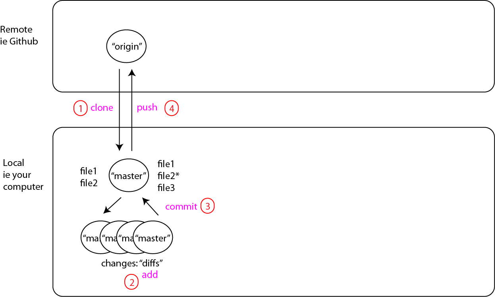
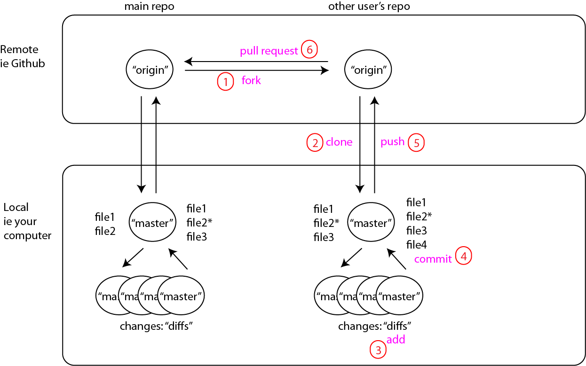
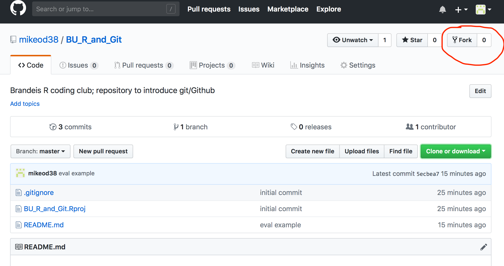
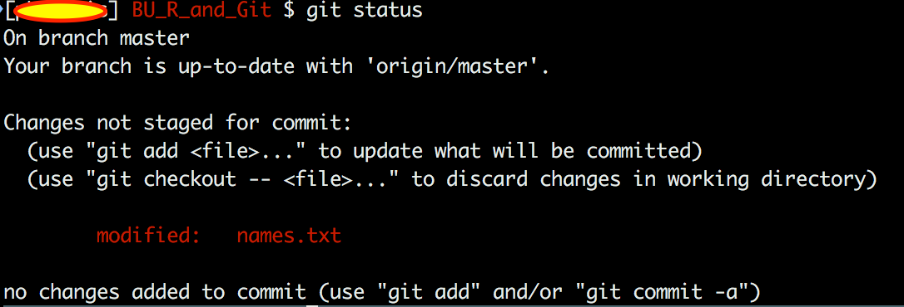
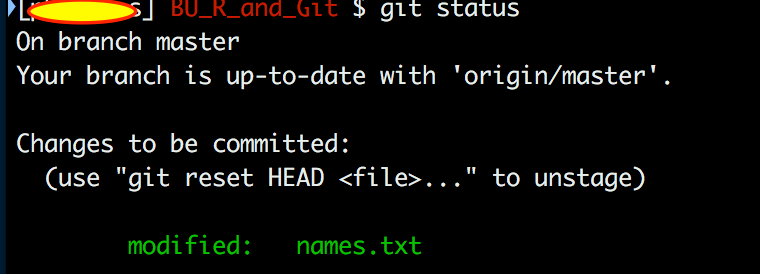

Senguptlet R tutorial
=====================

The purpose of this repository is a brief intro for the Sengupta lab to learn to use git and github.

Using git/github for just yourself
----------------------------------

So the steps are:

-   set up git on your computer (if it isn't already)
-   set up a Github account
-   (optional) get a Github GUI - I like GitKraken, but find myself doing all of the git stuff in Terminal, unless I really screw something up. These are nice for viewing changes (diffs) in your repository, however.

These are the simplest steps for keeping a repository just for yourself: 

This is what it looks like to actually do these steps:

<iframe width="650" height="420" src="https://www.youtube.com/embed/Cf3xos1D8zw" frameborder="0" allow="accelerometer; autoplay; encrypted-media; gyroscope; picture-in-picture" allowfullscreen>
</iframe>


Multi-user approach
-------------------

And this is the simplest approach to collaborate: 

So try it yourself:

The goal is to simply submit a pull request to edit the document names.txt - adding your name to the file. When you've done it successfully, I'll accept the change in the repository.

-   fork this repository: <https://github.com/mikeod38/Sengupta_git_tutorial.git>



-   then clone this repository to a folder you'd like to keep track of git projects

``` r
# in Terminal/shell
$ git clone https://github.com/<your Github username>/Sengupta_git_tutorial.git
```

-   next, edit the file.txt document using any text editor (NOT MS WORD) to add your name.

``` r
Mike O'Donnell
(your name here)
```

-   then you need to talk to git to tell it you'd like to "stage", then "commit" your changes

make sure you've actually changed something and that git is tracking it:

``` bash
$ git status
```



note the red text indicating it's not staged yet.

``` bash
$ git add .
# the '.' indicates you want all files to be staged, you can explicitly type the filenames if you don't
```

now check to be sure it's staged:

``` bash
$ git status
```



note the green text. Now you're ready to commit:

``` bash
$ git commit -m "added my name"
```

the -m is for message, which is mandatory. If you leave it out, it will open your default text editor since git assumes you wanted to do a long message.

now push to your remote repo ("origin" on Github) "Master"

``` bash
$ git push origin master
```

Now that you've pushed the file to your Forked Github repo, you can press the pull-request button on the file in my repo so I can accept the changes.

Good luck.
