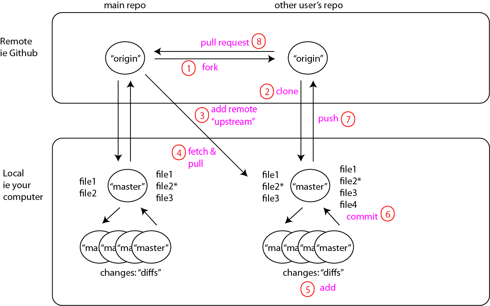

Senguptlet R tutorial
=====================

The purpose of this repository is a brief intro for the Sengupta lab to learn to use git and github.

### Using git/github for just yourself

So the steps are:

-   set up git on your computer (if it isn't already)

Mac: Open Terminal, type:

``` bash
which git
```

If you got a path then you are good. In most cases it should already be set up for you.

PC: you need to get git bash installed:

<https://gitforwindows.org>

-   set up a Github account
-   (optional) get a Github GUI - I like GitKraken, but find myself doing all of the git stuff in Terminal, unless I really screw something up. These are nice for viewing changes (diffs) in your repository, however.

### These are the simplest steps for keeping a repository just for yourself:


This is what it looks like to actually do these steps:

<iframe width="650" height="420" src="https://www.youtube.com/embed/Cf3xos1D8zw" frameborder="0" allow="accelerometer; autoplay; encrypted-media; gyroscope; picture-in-picture" allowfullscreen>
</iframe>


### Multi-user approach

And this is the simplest approach to collaborate to solve a single or limited number of problems: 

So try it yourself:

The goal is to simply submit a pull request to edit the document names.txt - adding your name to the file. When you've done it successfully, I'll accept the change in the repository.

-   fork this repository: <https://github.com/mikeod38/Sengupta_git_tutorial.git>


-   then clone this repository to a folder you'd like to keep track of git projects

``` r
# in Terminal/shell
$ git clone https://github.com/<your Github username>/Sengupta_git_tutorial.git
```

-   next, edit the file.txt document using any text editor (NOT MS WORD) to add your name.

``` r
Mike O'Donnell
(your name here)
```

-   then you need to talk to git to tell it you'd like to "stage", then "commit" your changes

make sure you've actually changed something and that git is tracking it:

``` bash
$ git status
```


note the red text indicating it's not staged yet.

``` bash
$ git add .
# the '.' indicates you want all files to be staged, you can explicitly type the filenames if you don't
```

now check to be sure it's staged:

``` bash
$ git status
```


note the green text. Now you're ready to commit:

``` bash
$ git commit -m "added my name"
```

the -m is for message, which is mandatory. If you leave it out, it will open your default text editor since git assumes you wanted to do a long message.

now push to your remote repo ("origin" on Github) "Master"

``` bash
$ git push origin master
```

Now that you've pushed the file to your Forked Github repo, you can press the pull-request button on the file in my repo so I can accept the changes.

Good luck.

### Keeping your local up-to-date:

After an accepted pull-request, there may be additional changes to your file, for example if there were any conflicts or additions that occurred after your forked your repo. To keep your local up to date, you should do 2 things, "fetch" and "pull" locally:

``` bash
bash_prompt$ git fetch

#make sure you are on your 'master' branch
```

``` bash
bash_prompt$ git pull

#make sure you are on your 'master' branch
```

### Keeping your remote up to date (for constant collaboration and sync):



If you submitted a pull-request which was accepted, your file will be up to date, but if someone else does after that, it won't automatically. So you need to do the same thing you did locally above, but 'upstream'. Again, make sure you are on your 'master' branch.

First, you need to set an additional remote from which you can fetch and pull - we'll call this "upstream" - use the URL from the repo that you want to keep in sync (ie my copy)

``` bash
bash_prompt$ git remote add uptream https://github.com/<main github username>/Sengupta_git_tutorial.git

#make sure you are on your 'master' branch
```

You can now check to make sure it worked, you should now have two different URLs for remote access:

``` bash
bash_prompt$ git remote -v
```

``` bash
bash_prompt$ git fetch upstream

#this will show the status of the upstream repo and any branches
```

``` bash
bash_prompt$ git pull upstream <branch name>
```

That's it. There's more to managing branches effectively, or if you want to only selectively sync etc... but those are the basics.
